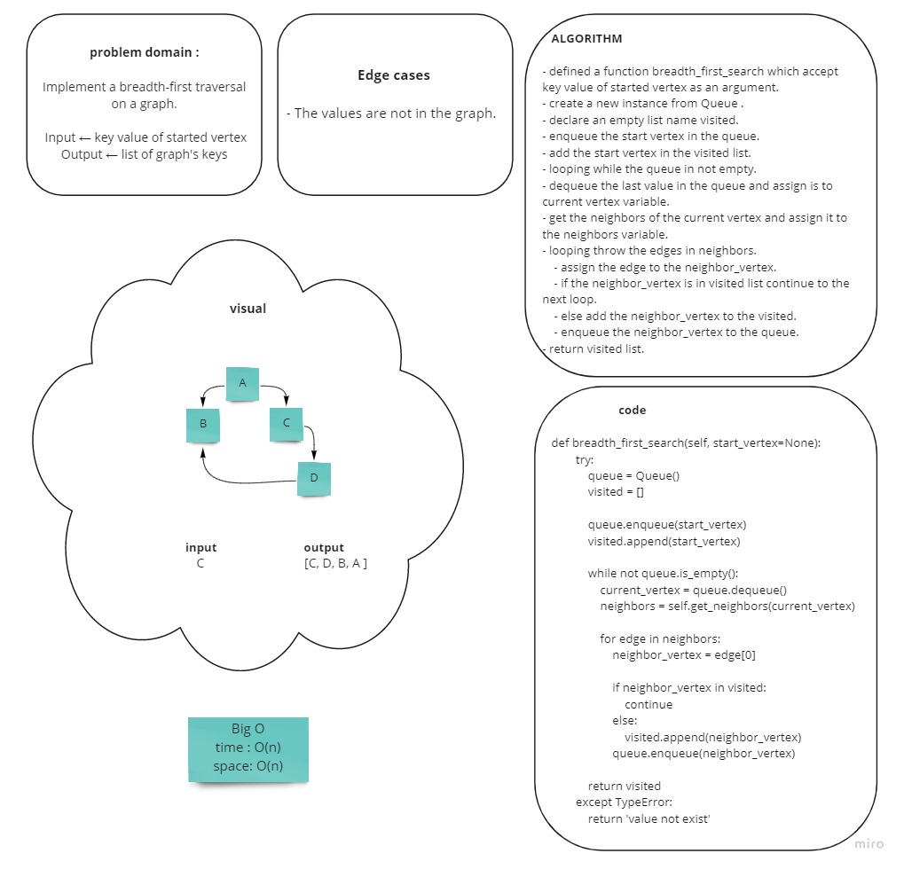
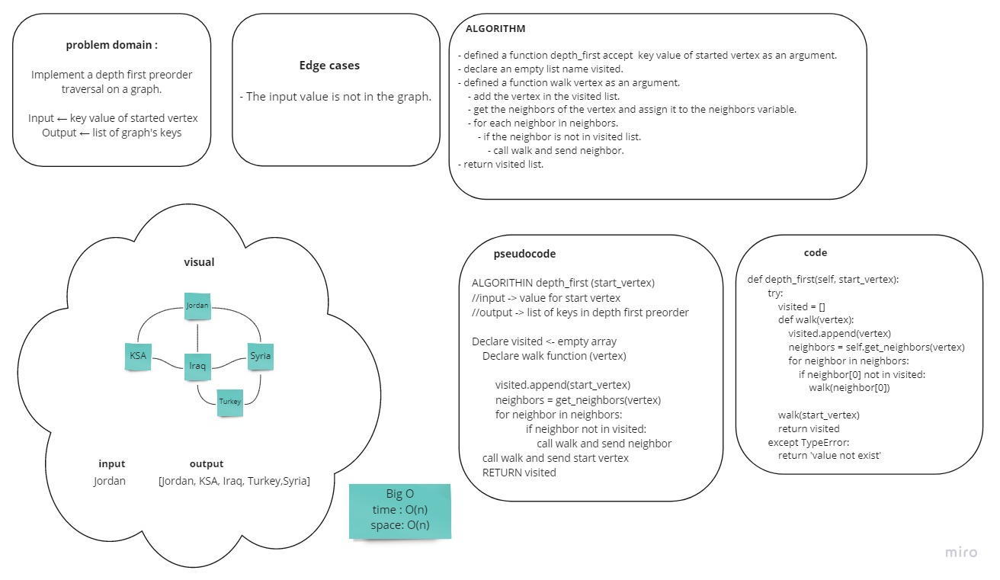

# Graphs
A graph is a non-linear data structure that can be looked at as a collection of vertices (or nodes) potentially connected by line segments named edges.

## Challenge
Implement your own Graph. The graph should be represented as an adjacency list, and should include the following 

### methods:

 - add node
     Arguments: value = Returns: The added node
     Add a node to the graph
 - add edge
     Arguments: 2 nodes to be connected by the edge, weight (optional)
     Returns: nothing
     Adds a new edge between two nodes in the graph
     If specified, assign a weight to the edge
     Both nodes should already be in the Graph
 - get nodes
     Arguments: none
     Returns all of the nodes in the graph as a collection (set, list, or similar)
 - get neighbors
     Arguments: node
     Returns a collection of edges connected to the given node
     Include the weight of the connection in the returned collection

## Approach & Efficiency
 - add_node():
     time Big O(1)
     space Big O(1)
 
 - add_vertex():
     time Big O(1)
     space Big O(1)
 
 - add_edge():
     time Big O(1)
     space Big O(1)
 
 - get_neighbors():
     time Big O(1)
     space Big O(1)

 - size():
     time Big O(1)
     space Big O(1)

## API
 - add node
     Arguments: value = Returns: The added node
     Add a node to the graph
 - add edge
     Arguments: 2 nodes to be connected by the edge, weight (optional)
     Returns: nothing
     Adds a new edge between two nodes in the graph
     If specified, assign a weight to the edge
     Both nodes should already be in the Graph
 - get nodes
     Arguments: none
     Returns all of the nodes in the graph as a collection (set, list, or similar)
 - get neighbors
     Arguments: node
     Returns a collection of edges connected to the given node
     Include the weight of the connection in the returned collection
## Breadth first

## Depth first
  Write the depth first method for the Graph class:

 - Arguments: An adjacency list as a graph
 - Return: A collection of nodes in their pre-order depth-first traversal order
 - Display the collection
 - Approach & Efficiency
 - Big O:
     Time -> O(n)
     Space -> O(n)
