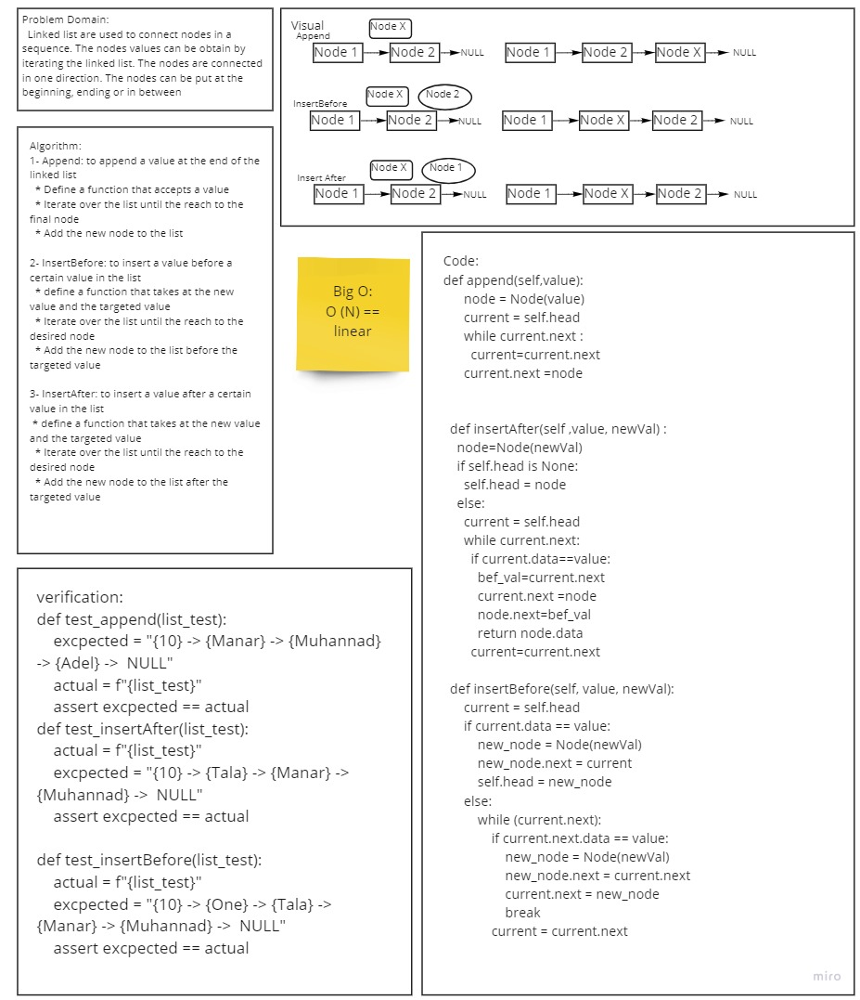

# Singly Linked List
Linked List is a type of data structure
## Challenge
[Code 05](https://github.com/talahajeer/data-structures-and-algorithms/pull/26)
## Approach & Efficiency

## Efficiency
Big O :
O(1) Time/space performance for insert method.
O(n) Time and O(1) space performance for includes method.

# New Features to linked_list
 
## Approach & Efficiency
  Big O is linear

### ll-kth-from-end
