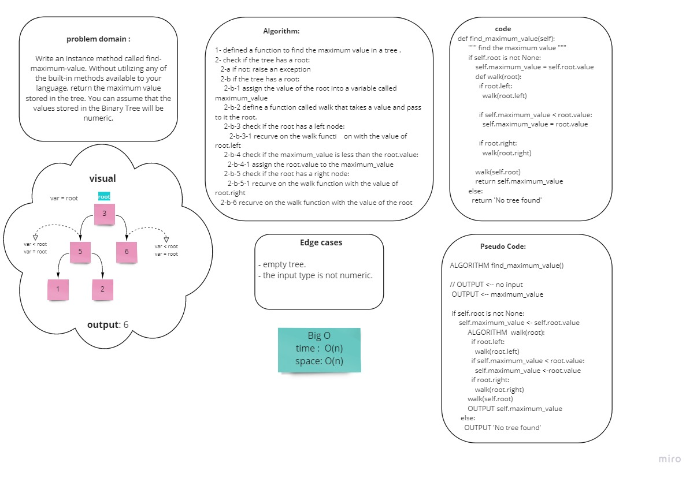

# Binary Tree

## Big O:
    - time : O(n)

## 
  Fixed the code in collaboration with Noor, Manar

## Implemintation of find_maximum_value
 In collaboration with Manar and Noor
  

## Implemintation of Bread First
  In collaboration with Manar and Noor
  